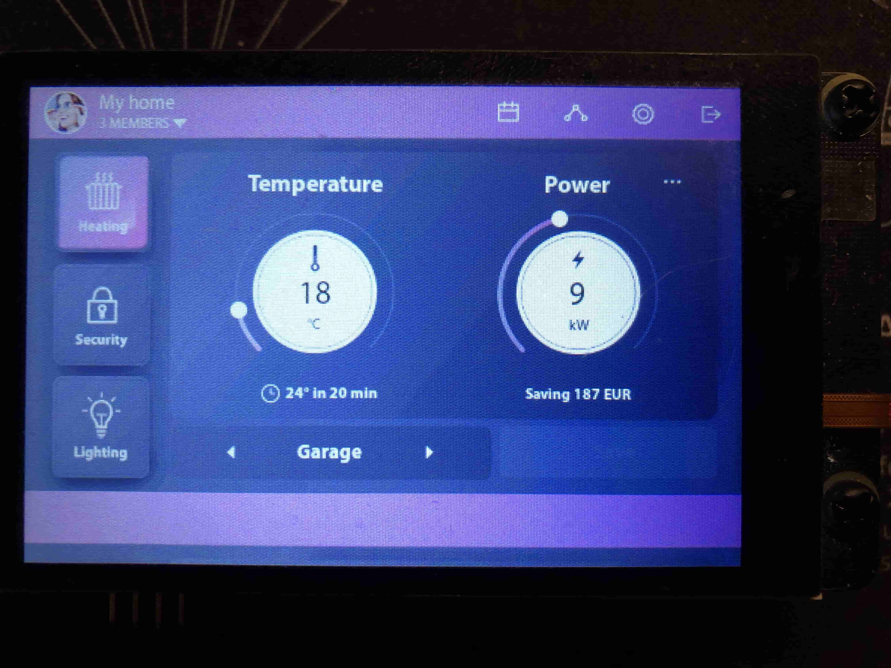

### EEZ-Studio LVGL Smart Home Low Res demo porting for Pico_DM_QD3503728.

Note: overclocking disabled. Use at own risk.

Memory usage on Pico board:
```
[646/647] Linking CXX executable pico_dm_qd3503728.elf
Memory region         Used Size  Region Size  %age Used
           FLASH:     2078756 B         2 MB     99.12%
             RAM:      247612 B       256 KB     94.46%
       SCRATCH_X:          0 GB         4 KB      0.00%
       SCRATCH_Y:          0 GB         4 KB      0.00%
[647/647] Print target size info
      text       data        bss      total filename
    386704    1692052     219976    2298732 pico_dm_qd3503728.elf
```

